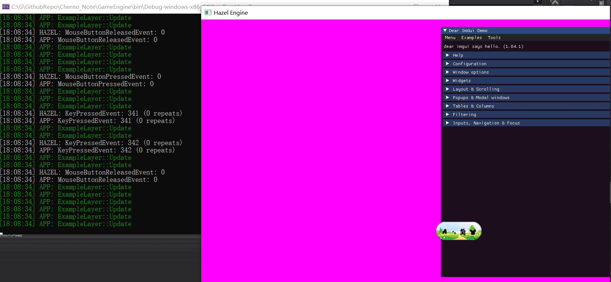

# Cherno_Note
Cherno系列手记

课程地址: https://www.bilibili.com/video/BV1KE41117BD?p=4&spm_id_from=pageDriver

## 学习进展

1-22(ImGui集成完毕!):  
  

1-23(ImGui接入glfw事件系统`)

## 依赖库

日志(spdlog):  
https://github.com/gabime/spdlog

编译(premake):  
https://github.com/premake/premake-core/releases
 
跨平台窗口(GLFW[实现的一个OpenGL接口封装库] - 不支持DirectX,后面可能会改):  
https://github.com/TheCherno/glfw

GLAD(OpenGL接口函数整理(只是胶水)):  
https://glad.dav1d.de/

ImGui(图形化UI界面):  
https://github.com/TheCherno/imgui

## 项目启动流程

先进入`GameEngine`目录  

点击`GenerateProject.bat`  
主要流程是,先编写`premake5.lua`脚本,然后借助`premake`编译生成对应平台的项目工程  
然后Windows可以用VS打开`HazelEngine.sln`,直接运行即可  
注意: 有可能第一次编译会报`MSB3073`错误,别管他,再运行一次就可以了

注意,如果要迁移平台,要在对应平台编写相应的`shell`
