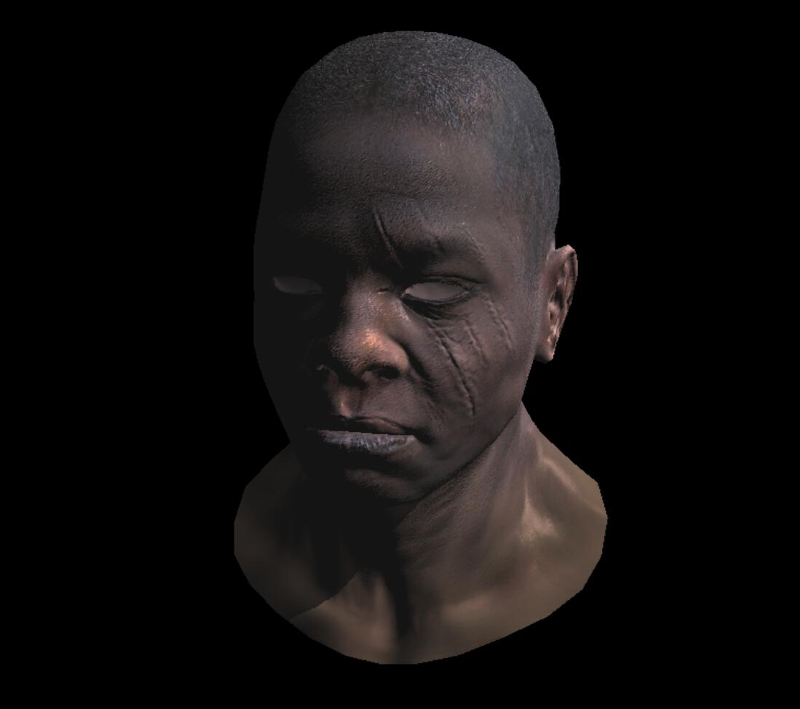

# 渲染学习手记

## 软光栅(tinyrenderer完结)

两种方法,一种方法是使用OpenGl一类的库只使用DrawPixel  
软渲染是使用CPU来模拟GPU渲染流水线的渲染器  

唯一用到的GPU是DrawPixel()函数

另一种方法是只保存渲染后的结果,保存到一张图片中,tinyrenderer使用的是TGA图片格式  

## 软光栅(Games101作业)

Games101使用的是opencv,其中的内容和tinyrender差别挺大的,可以互相补充

## 介绍 

这个仓库是冬狼用来学习渲染知识的一个仓库  
不同的分支代表的是不同的路径  
中间可能会间断的学习不同的知识  
当前主分支是用来学习软渲染的  
学习的目标仓库在这:  https://github.com/ssloy/tinyrenderer/wiki

DirectX12: https://github.com/834930269/Graphics_Note/tree/DirectX12  
LearnOpenGL: https://github.com/834930269/Graphics_Note/tree/LearnOpenGL  
Cherno的游戏引擎系列: https://github.com/834930269/Graphics_Note/tree/main  
tinyrenderer(软光栅): https://github.com/834930269/Graphics_Note/tree/SoftRenderer

