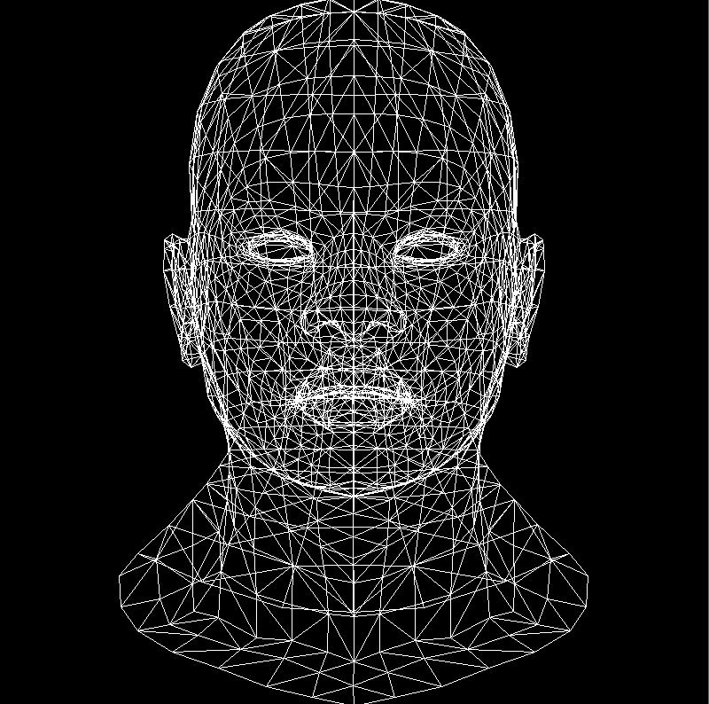

# 最简单的画线方法

两点可以确定一条线.然后在这条线上步进就可以了   

```cpp
void line(int x0, int y0, int x1, int y1, TGAImage& image, TGAColor color) {
	for (float t = 0; t < 1; t += 0.01) {
		int x = x0 + (x1 - x0) * t;
		int y = y0 + (y1 - y0) * t;
		image.set(x, y, color);
	}
}
```

# 第二种尝试  

第一种画线存在的问题是需要采样的点很多,第二种方法是找哪几个像素点需要被绘制

```cpp
void line(int x0, int y0, int x1, int y1, TGAImage& image, TGAColor color) {
	for (int x = x0; x <= x1; x++) {
		float t = (x - x0) / (float)(x1 - x0);  //计算是第几个点站所有点的比率
		int y = y0 * (1. - t) + y1 * t;         //计算在这个比率下的y坐标(类似于插值,每个像素插一次值)
		image.set(x, y, color);
	}
}
```

结果如下:  


其中一条线的结果看起来很好,但是另一条线上有很多空洞.第三条线和第一条线重合起来了.因为绘制的顺序导致的覆盖

# 第三种方法

产生洞的原因高度大于宽度,解决这个问题最简单的一个方法是,先交换宽度和高度中大的和小的部分,确保大的部分在前面.

(Holy cow! 天哪)

```cpp
void line(int x0, int y0, int x1, int y1, TGAImage& image, TGAColor color) {
    bool steep = false;
    if (std::abs(x0 - x1) < std::abs(y0 - y1)) { // if the line is steep, we transpose the image 
        std::swap(x0, y0);
        std::swap(x1, y1);
        steep = true;
    }
    if (x0 > x1) { // make it left−to−right 
        std::swap(x0, x1);
        std::swap(y0, y1);
    }
    for (int x = x0; x <= x1; x++) {
        float t = (x - x0) / (float)(x1 - x0);
        int y = y0 * (1. - t) + y1 * t;
        if (steep) {
            image.set(y, x, color); // if transposed, de−transpose 
        }
        else {
            image.set(x, y, color);
        }
    }
}
```

# 第四种方法

第四种方法仍然回到了步进法,只不过是自动计算步进区间,而非手动指定步进区间

上面那段代码产生的性能损耗如下所示:  

```
%   cumulative   self              self     total 
 time   seconds   seconds    calls  ms/call  ms/call  name 
 69.16      2.95     2.95  3000000     0.00     0.00  line(int, int, int, int, TGAImage&, TGAColor) 
 19.46      3.78     0.83 204000000     0.00     0.00  TGAImage::set(int, int, TGAColor) 
  8.91      4.16     0.38 207000000     0.00     0.00  TGAColor::TGAColor(TGAColor const&) 
  1.64      4.23     0.07        2    35.04    35.04  TGAColor::TGAColor(unsigned char, unsigned char, unsigned char, unsigned char) 
  0.94      4.27     0.04                             TGAImage::get(int, int)
```

可以看到70%的时间都花到了line()函数上

这就是需要优化的地方

1. 我们注意到上面的代码中,每次除的都是相同的数,所以可以省略掉除法  
2. 然后由于像素实际上都是整数值,所以可以只在整数时进行绘制,减少y更新次数,只在误差大的时候更新

算法:  

```cpp
void line(int x0, int y0, int x1, int y1, TGAImage& image, TGAColor color) {
    bool steep = false;
    if (std::abs(x0 - x1) < std::abs(y0 - y1)) { // if the line is steep, we transpose the image 
        std::swap(x0, y0);
        std::swap(x1, y1);
        steep = true;
    }
    if (x0 > x1) { // make it left−to−right 
        std::swap(x0, x1);
        std::swap(y0, y1);
    }

    int dx = x1 - x0;
    int dy = y1 - y0;
    float derror = std::abs(dy / float(dx));//每次增加多少
    float error = 0;    //累计步进
    int y = y0;         //初始步进
    for (int x = x0; x <= x1; x++) {
        if (steep) {
            image.set(y, x, color);
        }
        else {
            image.set(x, y, color);
        }
        error += derror;    //累加步进
        if (error > .5) {   //如果步进大于.5,更新y
            y += (y1 > y0 ? 1 : -1);
            error -= 1.;
        }
    }
}
```


# 第五种方法

接下来要考虑的是是否float类型是必要的?  
我们知道像素的坐标一定是整数类型  
这里就可以思考一下,`dy/dx`代表的是dx每走一步,dy要走多少  
但是dx和dy本身就是整数,可以理解为,每步走dy长度,如果这个长度大于了dx,就意味着整体需要向前走一步  

```cpp
void line(int x0, int y0, int x1, int y1, TGAImage &image, TGAColor color) { 
    bool steep = false; 
    if (std::abs(x0-x1)<std::abs(y0-y1)) { 
        std::swap(x0, y0); 
        std::swap(x1, y1); 
        steep = true; 
    } 
    if (x0>x1) { 
        std::swap(x0, x1); 
        std::swap(y0, y1); 
    } 
    int dx = x1-x0; 
    int dy = y1-y0; 
    int derror2 = std::abs(dy)*2; 
    int error2 = 0; 
    int y = y0; 
    for (int x=x0; x<=x1; x++) { 
        if (steep) { 
            image.set(y, x, color); 
        } else { 
            image.set(x, y, color); 
        } 
        error2 += derror2; 
        if (error2 > dx) { 
            y += (y1>y0?1:-1); 
            error2 -= dx*2; 
        } 
    } 
} 
```


# 最终-绘制一个模型的所有线

一个模型是由很多三角片元组成的,每个三角片元都有三条线,所以本节的目的是把这个模型的x和y的线绘制出来

先从这个连接中把geometry.h、model.cpp、model.h这三个文件拉到自己项目中,然后是obj目录下的模型文件也放到项目中  

最后把main.cpp改成下述代码:  

```cpp
#include <vector>
#include <cmath>
#include "tgaimage.h"
#include "model.h"
#include "geometry.h"

const TGAColor white = TGAColor(255, 255, 255, 255);
const TGAColor red = TGAColor(255, 0, 0, 255);
Model* model = NULL;
const int width = 800;
const int height = 800;

void line(int x0, int y0, int x1, int y1, TGAImage& image, TGAColor color) {
    bool steep = false;
    if (std::abs(x0 - x1) < std::abs(y0 - y1)) { // if the line is steep, we transpose the image 
        std::swap(x0, y0);
        std::swap(x1, y1);
        steep = true;
    }
    if (x0 > x1) { // make it left−to−right 
        std::swap(x0, x1);
        std::swap(y0, y1);
    }

    int dx = x1 - x0;
    int dx2 = dx * 2;
    int dy = y1 - y0;
    int derror = std::abs(dy)*2;//每次增加多少
    int error = 0;    //累计步进
    int y = y0;         //初始步进
    for (int x = x0; x <= x1; x++) {
        if (steep) {
            image.set(y, x, color);
        }
        else {
            image.set(x, y, color);
        }
        error += derror;    //累加步进
        if (error > dx) {   //如果步进大于.5,更新y
            y += (y1 > y0 ? 1 : -1);
            error -= dx2;
        }
    }
}


int main(int argc, char** argv) {
    if (2 == argc) {
        model = new Model(argv[1]);
    }
    else {
        model = new Model("obj/african_head.obj");
    }

    TGAImage image(width, height, TGAImage::RGB);
	
    for (int i = 0; i < model->nfaces(); i++) {
        std::vector<int> face = model->face(i);
        //绘制面上的三条线
        for (int j = 0; j < 3; ++j) {
            Vec3f v0 = model->vert(face[j]);
            Vec3f v1 = model->vert(face[(j + 1) % 3]);
            //归一到屏幕坐标上
            int x0 = (v0.x + 1.) * width / 2.;
            int y0 = (v0.y + 1.) * height / 2.;
            int x1 = (v1.x + 1.) * width / 2.;
            int y1 = (v1.y + 1.) * height / 2.;
            line(x0, y0, x1, y1, image, white);
        }
    }

    image.flip_vertically();	//希望原点在左下方
	image.write_tga_file("output.tga");

    //释放model
    delete model;
	return 0;
}
```


结果如下图所示:  

