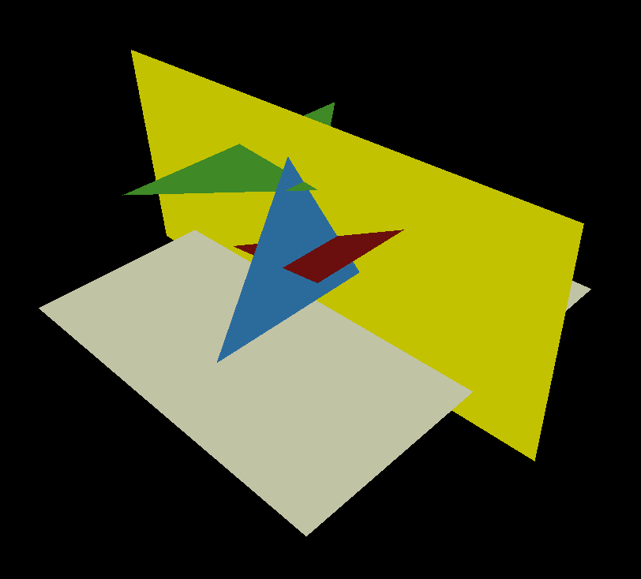
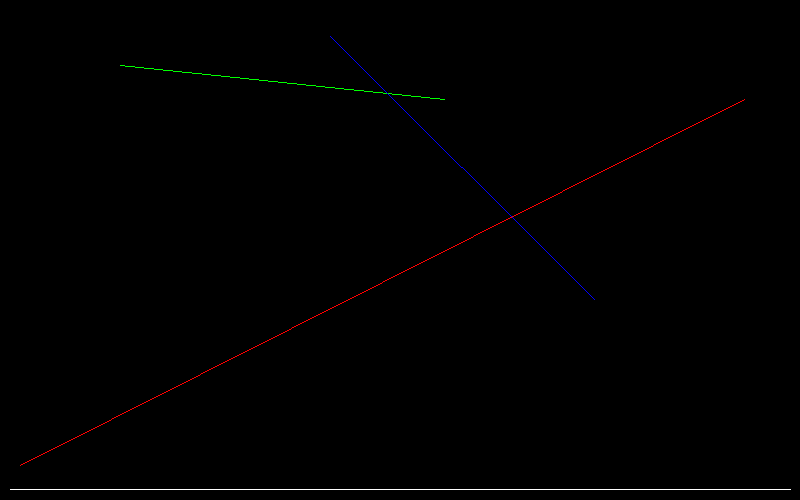
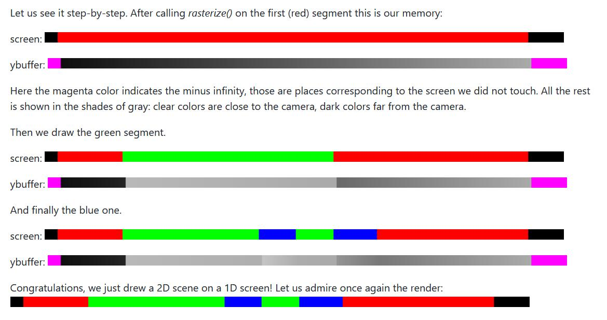

# 首先考虑一个问题  

理论上我们可以通过绘制所有的三角形来实现像素的覆盖,这就是著名的画家算法  
但是值得注意的是,如果绘制所有的三角形,那就意味着绘制的时候所有三角形需要进行一次排序  
如果每移动一次摄像机就要排序一次,则会造成极大地消耗  

所以就提出了Z-Buffer来解决这个问题

想像一个场景中有三个三角形互相交叉,如下图所示:   

正交投影下的渲染结果应该是下述结果  

蓝色究竟是在红色前面还是后面,画家算法无法判断这一点,当然我们可以将三角形分成两个,一部分在前面,一部分在后面,BST树可以解决这个问题,但是它太过复杂,生命短暂不要复杂!

为了降低复杂度,这里丢失一个维度,使用Y-Buffer来做演示

我们可以如上图一样,将三个面片在二维平面上映射起来,可以认为是一个(高度图xd),如下图所示:  

我们可以清晰地从这个图中看出绘制顺序,实际上我们只需要将这个顺序记录到z-buffer中就可以正确的对像素绘制啦！

    其实Y-buffer可以归一化到0-1之中来生成灰度图  

比如下述y-buffer的深度灰度图

# 回到3D

在3D中我们需要的是Z-buffer  
屏幕空间的是x,y坐标,而Zbuffer代表的就是深度  
每个片元(像素)都有一个z-buffer  

如何计算z-buffer呢  
首先对于一个三角形,我们只知道它的三个顶点,记为A,B,C  
对于这个三角形内任意一个点,其实我们可以找到他的`重心坐标`,计算出重心坐标后有两个好处   
- 1. 我们可以判断一个点是否在三角形内 
- 2. 我们可以用重心坐标反推出这个像素的z坐标

# 作业-如何计算uv坐标

计算z坐标的方法实际上可以应用到uv坐标上,对每个像素使用相同的算法可以求出该像素在三角形中的实际uv坐标,  

得到像素在uv坐标上的坐标后,可以通过插值或者直接去颜色贴上去

这样子可以求得每个三角形的所有像素的颜色,记为`片元`

