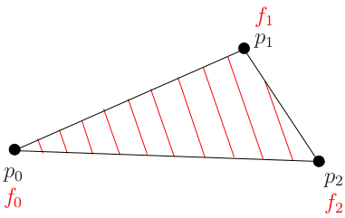
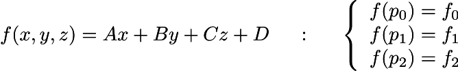
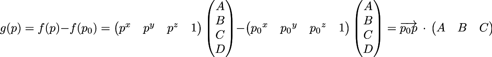
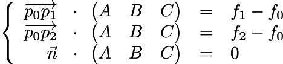
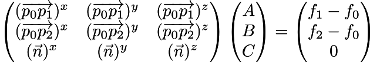
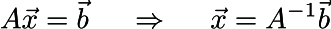

# 法线贴图的作用?

当我们在制作模型的时候,可能会尝试制作一个高模,高模会具备很多细节,但是如果导出到一些对性能要求很高的设备(如安卓)上  
就需要导出低模,但是低模的细节非常少,这时候怎么办呢?  
一种解决的方法就是在制作高模的时候导出一张法线贴图,这张贴图将记录这个模型上大部分的法线方向  
然后在低模片元着色器中找到对应位置的法线，假设该片元的法线,然后进行模拟

# RGB法线贴图与切线空间法线贴图相比的优势

RGB存储的是每个点的实际法线方向,这就代表着每个点必须和模型上的每个点一致  
但是切线空间的法线贴图是对于一个三角形的单独的一个顶点而言的基坐标系  

这也就代表了,对于一个单独的法线贴图,实际上可以用到任意模型上  

另外,由于切线空间是根据模型表面计算的,所以可以进行uv动画

# 切线空间  

在切线空间中,+z从表面指向外面,+z`基矢量`实际上只是表面法线.表示为`n`  
x基矢量被称为切线(Tangent)矢量,表示为`u`  
y基矢量被称为副法线(Binormal),表示为`v`

其中贴图上的x坐标代表的是切线矢量,右侧指向u的正方向  
基矢量通常被存储为`单位矢量`  

总之,所谓的切线空间的目的是将`切线,法线,副法线`作为基的一个坐标系

那么如何计算这个切线空间的基呢?  

# 计算切线空间的基

1. 给定三角形三个顶点 P0=(x0,y0,z0) P1=(x1,y1,z1) P2=(x2,y2,z2)
2. 三个顶点的uv坐标 (u0,v0) (u1,v1) (u2,v2)  

首先想象一下,我们是否可以提供一个方程f(x,y,z) = Ax+By+Cz+D来对三角形内任意元素计算一个值   
唯一的问题是我们不知道ABCD的值,但是我们知道三个顶点的值

  

   

对于一个函数而言,上升最快的方向就是它的梯度值,和明显,对于f(x,y,z)而言,它的梯度值就是(A,B,C),所以目标就是通过三个顶点重建出ABC

假设g(p) = f(p)-f(p0)  

则 g(p0) = 0 、 g(p1) = f(p1) - f(p0) 、 g(p2) = f(p2) - f(p0)

结合f=Ax+By+Cz+D，得出下述公式  

我们可以得到三个公式,即g(P0)、g(P1)、g(P2)  
由于g(P0) = 0 所以可以认为是寻找一个与ABC向量垂直的向量(其实是矢量,但是在这里看做向量)  

改成矩阵表现方法,这里的n向量并不是法线向量  

等价于Ax=b,即x可以由A矩阵的逆求出  

在前面说到了,我们想要找到一个矩阵ABC,可以让三角形内的任何片元坐标都可以用f(x,y,z)来表示   
那么三个顶点也就可以这样表示  
后面的矩阵是基于`g`来做的  
g(P0) = 0  
g(P1) = f(P1) - f(P0)  
g(P2) = f(P2) - f(P0)  

以及下述公式  
  

