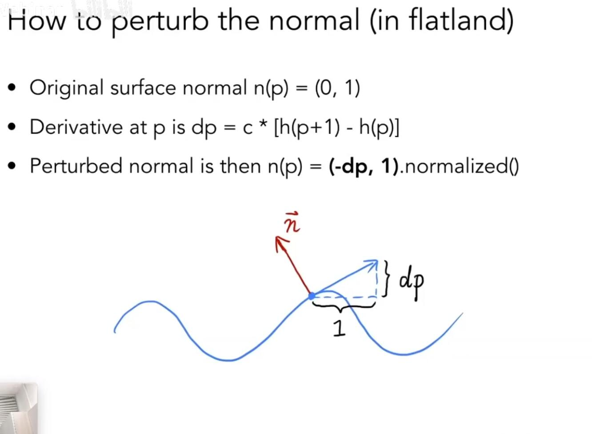
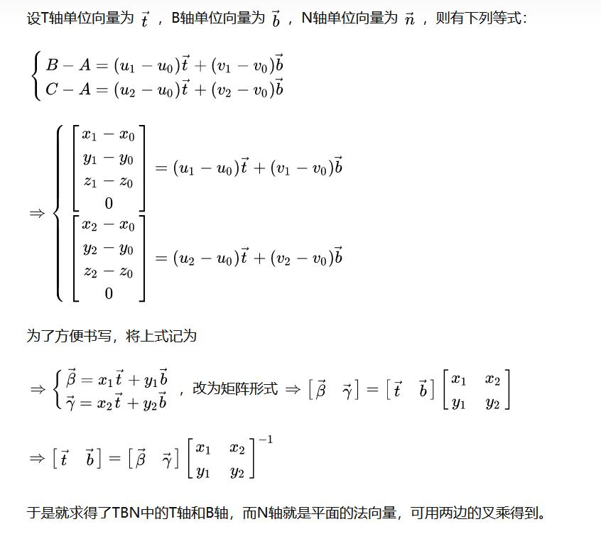

# 先来看看函数图像上的情况(一维)  

  

即定义dp为当前点向正方向移动一个单位的改变大小(可以理解为梯度,而梯度的方向就是切线)，这里直接使用差分(取邻近的两个点减一下即可)  

所以切线实际上就是 (1,dp)  

一维是其实很好计算这个点的法线,即法线和切线必然互相垂直,那么二维向量只需要旋转取反即是法线方向,即(-dp,1)

归一化的化直接normalized即可  


# 再来看看二维平面上的情况  

二维法线贴图实际存储的是沿当前uv坐标向前移动的梯度值

如u往前走一点,变化量,v往前走一点的变化量:  
- dp/du = c1*[h(u+1)-h(u)]  
- dp/dv = c2*[h(v+1)-h(v)]  

那么法线坐标就等与(-dp/du,-dp/dv,1).normalize()

我们知道,对于曲线而言,切线只有一个,但是对于曲面而言,切线有无数个  
所以为了简化问题,我们将uv展开方向作为求切线的方向  
首先我们先认为局部的法线是(0,0,1),然后再重新计算回世界坐标

1. 在切线空间中,法线永远指向z正方向(顶点的局部坐标)  
2. 为什么法线贴图基本都是很蓝的,因为法线贴图中大部分点的法线都是指向局部正z方向的,其他非蓝色的,也不过是在正z方向有所偏移而已

关于切线空间的介绍,LearnOpengl讲的还行  

https://learnopengl-cn.github.io/05%20Advanced%20Lighting/04%20Normal%20Mapping/

```
注意第9节有一个公式,f(x,y,z) = Ax+By+Cz  
其中x,y,z分别代表: 切线,副法线,法线这三个矢量  
所以目的是求A,B,C这三个系数  
法线方向矢量 f = Ax + By + Cz (切线局部空间内)  

贴图中存的就是这三个分量,如果没有发生偏移,则实际上存的就是(0,0,1),即纯蓝色 

也可以理解为(A,B,C)是在x,y,z这三个基向量代表的坐标系下的一个向量(它是当前顶点的法向量)
```

# TBN坐标系  

上述的法向量建立在TBN坐标系中,即Tangent,Binormal,normal  

其中Tangent对应了uv中的u轴,Binormal对应了uv中的v中,normal垂直于平面  

故当我们找到一个顶点的uv坐标后,就可以得到这个顶点的TBN坐标系

