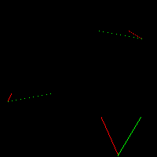
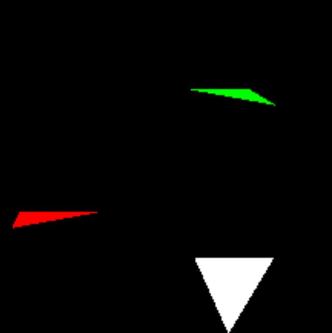
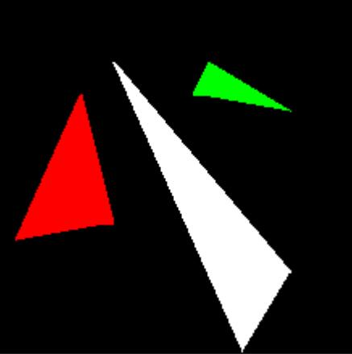
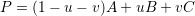
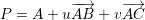
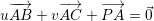
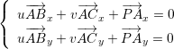
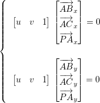
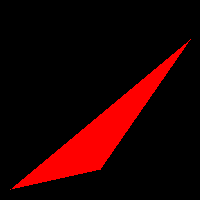
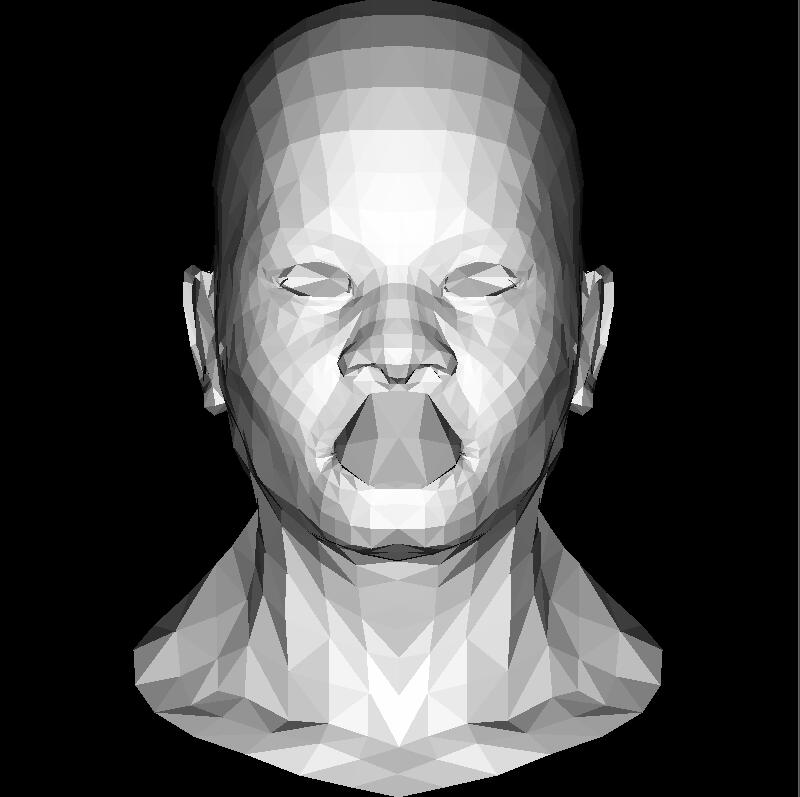

# 三角形封装

三条线可以组成一个三角形,所以可以把三角形封装起来

```cpp
void line(Vec2i x0, Vec2i x1, TGAImage& image, TGAColor color) {
    bool steep = false;
    if (std::abs(x0.x - x1.x) < std::abs(x0.y - x1.y)) { // if the line is steep, we transpose the image 
        std::swap(x0.x, x0.y);
        std::swap(x1.x, x1.y);
        steep = true;
    }
    if (x0.x > x1.x) { // make it left−to−right 
        std::swap(x0.x, x1.x);
        std::swap(x0.y, x1.y);
    }

    int dx = x1.x - x0.x;
    int dx2 = dx * 2;
    int dy = x1.y - x0.y;
    int derror = std::abs(dy)*2;//每次增加多少
    int error = 0;    //累计步进
    int y = x0.y;         //初始步进
    for (int x = x0.x; x <= x1.x; x++) {
        if (steep) {
            image.set(y, x, color);
        }
        else {
            image.set(x, y, color);
        }
        error += derror;    //累加步进
        if (error > dx) {   //如果步进大于.5,更新y
            y += (x1.y > x0.y ? 1 : -1);
            error -= dx2;
        }
    }
}

void triangle(Vec2i t0, Vec2i t1, Vec2i t2, TGAImage& image, TGAColor color) {
    line(t0, t1, image, color);
    line(t1, t2, image, color);
    line(t2, t0, image, color);
}
```


一个好的三角形绘制算法必须包含以下几个特征:  
- 他必须是简单且高效的
- 它必须是对称的,图片的绘制不应该依赖顶点的顺序
- 如果两个三角形有公共顶点,它们重叠的部分不应该有洞
- 我们可以增加更多的需求,但传统的光栅化算法使用的是扫线法
    - 1. 三角形根据顶点的y坐标排序
    - 2. 同时找到同一个y坐标下的三角形左侧和右侧
    - 3. 在左侧和右侧之间绘制线段

扫描线填充法其实是对于每行计算一下屏幕上的y=b(b在height内)与三角形的两个交点,然后两个交点内绘制线段.

在这个过程中,如果只有两条不同斜率的线,其实很容易做的,比如预处理每条线的斜率,然后根据点斜式和 y = b 求出交点后进行绘制.  
下一个交点则是求 y = b + 1

基于这个思路,由于我们提供的三角形通常是由三条边的,为了简化计算,我们可以按照其中某一个顶点按y轴将三角形分成两部分

比如下面的转型:  

  

↓↓↓↓↓↓↓↓↓↓↓



代码如下:  

```cpp
//暂时只绘制下半部分
void triangle(Vec2i t0, Vec2i t1, Vec2i t2, TGAImage& image, TGAColor color) {
    //先对y进行排序
    if (t0.y > t1.y) std::swap(t0, t1);
    if (t0.y > t2.y) std::swap(t0, t2);
    if (t1.y > t2.y) std::swap(t1, t2);
    
    //通过最大和最小值确定总的高度范围
    int total_height = t2.y - t0.y;
    int segment_height = t1.y - t0.y + 1;
    //这点绘制的是最小值和次小值之间的两端点
    for (int y = t0.y; y <= t1.y; ++y) {
        float alpha = (float)(y - t0.y) / total_height; //第一个线段的前进率
        float beta = (float)(y - t0.y) / segment_height;//第二个线段的前进率
        //得到AB两个端点(y坐标相同)
        Vec2i A = t0 + (t2 - t0) * alpha;
        Vec2i B = t0 + (t1 - t0) * beta;
        if (A.x > B.x) std::swap(A, B);
        //AB之间画线段
        for (int j = A.x; j <= B.x; j++) {
            image.set(j, y, color); // attention, due to int casts t0.y+i != A.y 
        }
    }
}
```

注释已经写上去了,上面主要是获取y = b下的两个端点,然后画直线

结果如下  




接下来补全上半部分


```cpp
void triangle(Vec2i t0, Vec2i t1, Vec2i t2, TGAImage& image, TGAColor color) {
    //先对y进行排序
    //t0 < t1 < t2
    if (t0.y > t1.y) std::swap(t0, t1);
    if (t0.y > t2.y) std::swap(t0, t2);
    if (t1.y > t2.y) std::swap(t1, t2);
    
    //通过最大和最小值确定总的高度范围
    int total_height = t2.y - t0.y;
    int segment_height = t1.y - t0.y + 1;
    int third_height = t2.y - t1.y + 1;
    //这点绘制的是最小值和次小值之间的两端点
    for (int y = t0.y; y <= t1.y; ++y) {
        float alpha = (float)(y - t0.y) / total_height; //第一个线段的前进率
        float beta = (float)(y - t0.y) / segment_height;//第二个线段的前进率
        //得到AB两个端点(y坐标相同)
        Vec2i A = t0 + (t2 - t0) * alpha;
        Vec2i B = t0 + (t1 - t0) * beta;
        if (A.x > B.x) std::swap(A, B);
        //AB之间画线段
        for (int j = A.x; j <= B.x; j++) {
            image.set(j, y, color); // attention, due to int casts t0.y+i != A.y 
        }
    }

    for (int y = t1.y; y <= t2.y; ++y) {
        float alpha = (float)(y - t0.y) / total_height; //第一个线段的前进率
        float beta = (float)(y - t1.y) / third_height;//第二个线段的前进率
        //得到AB两个端点(y坐标相同)
        Vec2i A = t0 + (t2 - t0) * alpha;
        Vec2i B = t1 + (t2 - t1) * beta;
        if (A.x > B.x) std::swap(A, B);
        //AB之间画线段
        for (int j = A.x; j <= B.x; j++) {
            image.set(j, y, color); // attention, due to int casts t0.y+i != A.y 
        }
    }
}
```

结果如下:  



上面的代码很乱,在实际的游戏开发中,往往会有大量的三角形需要绘制,所以通常会使用多线程或者GPU来进行绘制,上述代码实际上不好控并发编程  

# 基于重心坐标的可并行优化

什么是重心坐标:  https://zhuanlan.zhihu.com/p/58199366

重心坐标的定义是:  

```
对于空间三角形P1P2P3内任一点P，必定唯一存在三个数w1,w2,w3，满足：

w1+w2+w3=1

P=w1*P1+w2*P2+w3*P3 （即P表示成P1,P2,P3的线性组合）

则(w1,w2,w3)就称为此三角形上P点的（归一化）重心坐标。
```

为什么它叫重心坐标呢?  

对P=w1*P1+w2*P2+w3*P3变形得w1(P1-P)+w2(P2-P)+w3(P3-P)=0，即：  
对于PP1、PP2、PP3这三个向量而言,分别悬挂重量为w1、w2、w3的重物可以平衡  

**重心坐标和重心不一样!**

简单公式,设重心坐标为P，三个顶点为A、B、C，则P=  
  

把式子(1-u-v)展开,可以求得:  

  

移项:  



对x、y都建立相同的等式:  



转换成向量乘法:  




所以我们改进光栅化算法,我们迭代给定三角形边界框内的所有像素,我们计算每个像素的重心坐标,如果它至少有一个是负的,则该像素在三角形之外,否则绘制。

对于一个三角形的边界,其实就是三个顶点中最大最小的x,y

比如如下  
  
其实就是对这个红色三角形所在的四边形区域像素进行遍历,然后判断一个点是否在三角形内

伪代码如下  
```cpp
Vec3f barycentric(Vec2i *pts, Vec2i P) { 
    Vec3f u = Vec3f(pts[2][0]-pts[0][0], pts[1][0]-pts[0][0], pts[0][0]-P[0])^Vec3f(pts[2][1]-pts[0][1], pts[1][1]-pts[0][1], pts[0][1]-P[1]);
    /* `pts` and `P` has integer value as coordinates
       so `abs(u[2])` < 1 means `u[2]` is 0, that means
       triangle is degenerate, in this case return something with negative coordinates */
    if (std::abs(u.z)<1) return Vec3f(-1,1,1);
    return Vec3f(1.f-(u.x+u.y)/u.z, u.y/u.z, u.x/u.z); 
} 
 
void triangle(Vec2i *pts, TGAImage &image, TGAColor color) { 
    Vec2i bboxmin(image.get_width()-1,  image.get_height()-1); 
    Vec2i bboxmax(0, 0); 
    Vec2i clamp(image.get_width()-1, image.get_height()-1); 
    for (int i=0; i<3; i++) { 
        bboxmin.x = std::max(0, std::min(bboxmin.x, pts[i].x));
	bboxmin.y = std::max(0, std::min(bboxmin.y, pts[i].y));

	bboxmax.x = std::min(clamp.x, std::max(bboxmax.x, pts[i].x));
	bboxmax.y = std::min(clamp.y, std::max(bboxmax.y, pts[i].y));
    } 
    Vec2i P; 
    for (P.x=bboxmin.x; P.x<=bboxmax.x; P.x++) { 
        for (P.y=bboxmin.y; P.y<=bboxmax.y; P.y++) { 
            Vec3f bc_screen  = barycentric(pts, P); 
            if (bc_screen.x<0 || bc_screen.y<0 || bc_screen.z<0) continue; 
            image.set(P.x, P.y, color); 
        } 
    } 
} 
 
```


# 最终光栅化

回到最初,我们仍然可以读取模型的数据,然后画出三个点所表示的三角形,以及通过其中两个向量的叉积计算出法线  

法线和光线点积可以计算出强度  

这样,扫描线法光栅化代码如下:  

```cpp
#include <vector>
#include <cmath>
#include <iostream>
#include "tgaimage.h"
#include "model.h"
#include "geometry.h"

const TGAColor white = TGAColor(255, 255, 255, 255);
const TGAColor red = TGAColor(255, 0, 0, 255);
const TGAColor green = TGAColor(0, 255, 0, 0);
Model* model = NULL;
const int width = 800;
const int height = 800;

void line(Vec2i x0, Vec2i x1, TGAImage& image, TGAColor color) {
    bool steep = false;
    if (std::abs(x0.x - x1.x) < std::abs(x0.y - x1.y)) { // if the line is steep, we transpose the image 
        std::swap(x0.x, x0.y);
        std::swap(x1.x, x1.y);
        steep = true;
    }
    if (x0.x > x1.x) { // make it left−to−right 
        std::swap(x0.x, x1.x);
        std::swap(x0.y, x1.y);
    }

    int dx = x1.x - x0.x;
    int dx2 = dx * 2;
    int dy = x1.y - x0.y;
    int derror = std::abs(dy)*2;//每次增加多少
    int error = 0;    //累计步进
    int y = x0.y;         //初始步进
    for (int x = x0.x; x <= x1.x; x++) {
        if (steep) {
            image.set(y, x, color);
        }
        else {
            image.set(x, y, color);
        }
        error += derror;    //累加步进
        if (error > dx) {   //如果步进大于.5,更新y
            y += (x1.y > x0.y ? 1 : -1);
            error -= dx2;
        }
    }
}
void triangle(Vec2i t0, Vec2i t1, Vec2i t2, TGAImage& image, TGAColor color) {
    if (t0.y == t1.y && t0.y == t2.y) return; // i dont care about degenerate triangles
    if (t0.y > t1.y) std::swap(t0, t1);
    if (t0.y > t2.y) std::swap(t0, t2);
    if (t1.y > t2.y) std::swap(t1, t2);
    int total_height = t2.y - t0.y;
    for (int i = 0; i < total_height; i++) {
        bool second_half = i > t1.y - t0.y || t1.y == t0.y;
        int segment_height = second_half ? t2.y - t1.y : t1.y - t0.y;
        float alpha = (float)i / total_height;
        float beta = (float)(i - (second_half ? t1.y - t0.y : 0)) / segment_height; // be careful: with above conditions no division by zero here
        Vec2i A = t0 + (t2 - t0) * alpha;
        Vec2i B = second_half ? t1 + (t2 - t1) * beta : t0 + (t1 - t0) * beta;
        if (A.x > B.x) std::swap(A, B);
        for (int j = A.x; j <= B.x; j++) {
            image.set(j, t0.y + i, color); // attention, due to int casts t0.y+i != A.y
        }
    }
}

int main(int argc, char** argv) {
    if (2 == argc) {
        model = new Model(argv[1]);
    }
    else {
        model = new Model("obj/african_head.obj");
    }

    TGAImage image(width, height, TGAImage::RGB);
	
    Vec3f light_dir(0, 0, -1);

    for (int i = 0; i < model->nfaces(); ++i) {
        std::vector<int> face = model->face(i);
        Vec2i screen_coords[3];
        Vec3f world_coords[3];
        for (int j = 0; j < 3; ++j) {
            Vec3f v = model->vert(face[j]);
            //计算屏幕坐标(世界坐标转换为屏幕坐标)
            screen_coords[j] = Vec2i((v.x + 1.) * width / 2, (v.y + 1.) * height / 2);
            //计算世界坐标
            world_coords[j] = v;    
        }
        //计算法线,这个是叉积,通过重载^方式做的
        Vec3f n = (world_coords[2] - world_coords[0]) ^ (world_coords[1] - world_coords[0]);
        n.normalize();
        //计算光照强度,点积
        float intensity = n * light_dir;
        if (intensity > 0) {
            //绘制,做了一次背面剔除,如果光照强度小于0,代表不受光
            triangle(screen_coords[0], screen_coords[1], screen_coords[2], image, TGAColor(intensity * 255, intensity * 255, intensity * 255, 255));
        }
    }

    image.flip_vertically();	//希望原点在左下方
	image.write_tga_file("output.tga");

    //释放model
    delete model;
	return 0;
}
```


结果如下图:  

