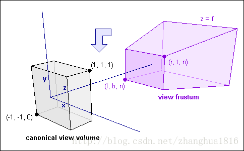
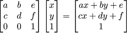
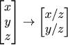
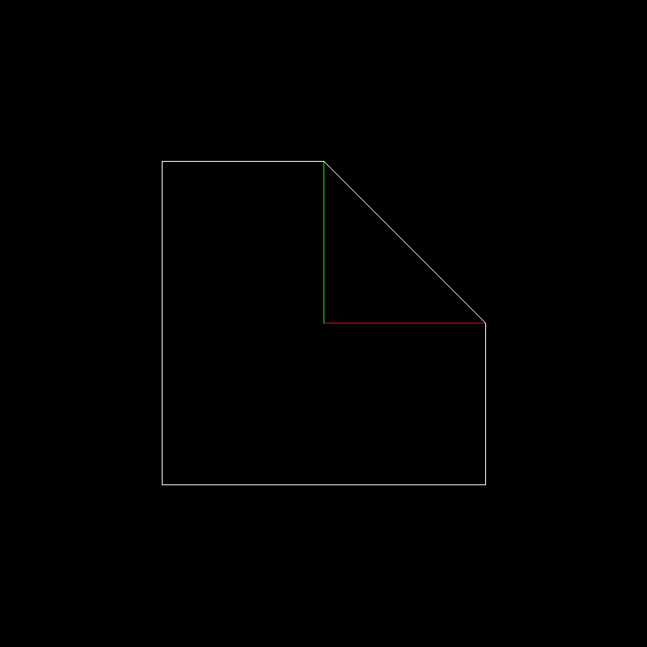

# 什么是透视投影?

在之前的课程中最终绘制的图像都是根据实际的x、y、z坐标来计算的,我们称这种表示法为`正交投影`  
但在实际的绘画与生活中,我们通常看到的情况是如下所示的:  

这就是透视投影,在图形学中的透视投影是根据压缩的比例来实现的  

如上图所示,实际上人的视力从视口平截面触发向远方延伸所能看到的范围是在不断增加的,但是增加的范围中的物体在视口平截面呈像时必须压缩到屏幕坐标空间(NDC)内,这就造成了一个很重要的区别:  

对于距离视口不同远近的物体,实际的压缩比率也不相同,故越远的物体在平截面上的压缩比率越大

# 实际内容  
这节课主要讲的其实是线性代数的变换

我们可以使用向量来代替一个坐标,然后使用变换矩阵来进行变换,然后我们需要考虑到一个问题,即是都每个顶点都需要乘上所有的变换矩阵,结论是不需要的,对于同一个模型而言,模型之上所有顶点的变换都是相同的,所以我们实际上可以预计算变换的矩阵,然后通过这个计算结果来直接参与顶点的计算.

# 什么是仿射变换

仿射变换简单来说就是线性变换加平移变换

线性变换特点:  
- 变换前是直线的,变换后依然是直线的
- 直线比例保持不变
- 变换前是原点的,变换后依然是原点 

比如三个变换,旋转、推移、缩放

但实际上在日常的变换中还有一个是平移,这时候为了方便计算,就引入了齐次坐标(Homogeneous coordinates)  

如果z坐标非1,则可以归一化,

齐次坐标中z=0代表的是向量,z=1代表的是点  
而变换实际上只对点有意义  
当`z=0`定义为向量时,有以下的性质  

- 1. 向量+向量=向量
- 2. 向量-向量=向量
- 3. 点+向量=向量

**齐次坐标实际上是在三维坐标平面上映射到二维坐标z=1平面上(对于二维齐次坐标而言)**

# 复杂变换

使用齐次坐标后,平移变换可以认为是一个平移矩阵就可以等价,而不需要多余的矩阵

接下来尝试对下图中的白色部分进行旋转变换(绿色和红色是辅助线),相机的视点在中心点  

旋转后的结果如下  

可以看出在辅助线的作用下,远离和靠近相机的部分分别发生了缩放

# 3D空间  

> 3D齐次坐标的实际意义是四维空间映射到三维空间  

