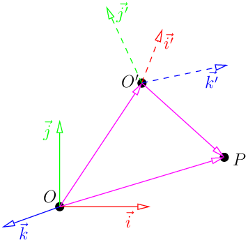
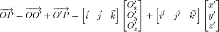
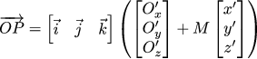
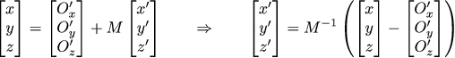
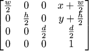

# 不同坐标系的坐标转换



如上图所示,O'和O是建立在两个不同的极坐标系下  

那么`O'P`向量如何转换到O的极坐标系下呢?  

两个线性相关的基可以用下述公示表示  
  
其中M矩阵是`过渡矩阵`  

两个性质:  
- 1. 两组基的过度矩阵一定是可逆的  
- 2. 一组基乘以可逆矩阵(任意,可以理解为进行了线性变换),结果仍然是一组基

# 基变换与坐标变换的关系

O'P向量在O的基坐标下表示如下式所示:  



其中基[i',j',k']可以基于基变换表示为M[i,j,k]  
所以就可以得到下述公式  



其中括号内整体就是转换后的坐标

坐标转回的公式如下:  




# 实现相机 

我们可以将相机进行固定,通过移动整个场景.而非移动相机,即相机作为一个坐标系的原点

# 实现代码  

> 原文章中当前和重心坐标方式差异过大,所以直接贴下源代码作为笔记  

https://github.com/ssloy/tinyrenderer/blob/10723326bb631d081948e5346d2a64a0dd738557/main.cpp

```cpp
#include <vector>
#include <iostream>
#include <cmath>
#include <limits>
#include "tgaimage.h"
#include "model.h"
#include "geometry.h"

const int width  = 800;
const int height = 800;
const int depth  = 255;

Model *model = NULL;
int *zbuffer = NULL;
Vec3f light_dir = Vec3f(1,-1,1).normalize();
Vec3f eye(1,1,3);
Vec3f center(0,0,0);

//求视口矩阵(就是那个平截体)
Matrix viewport(int x, int y, int w, int h) {
    Matrix m = Matrix::identity(4);
    m[0][3] = x+w/2.f;
    m[1][3] = y+h/2.f;
    m[2][3] = depth/2.f;

    m[0][0] = w/2.f;
    m[1][1] = h/2.f;
    m[2][2] = depth/2.f;
    return m;
}

//将模型矩阵转到摄像机坐标空间
Matrix lookat(Vec3f eye, Vec3f center, Vec3f up) {
    Vec3f z = (eye-center).normalize();
    Vec3f x = (up^z).normalize();
    Vec3f y = (z^x).normalize();
    Matrix res = Matrix::identity(4);
    for (int i=0; i<3; i++) {
        res[0][i] = x[i];
        res[1][i] = y[i];
        res[2][i] = z[i];
        res[i][3] = -center[i];
    }
    return res;
}

void triangle(Vec3i t0, Vec3i t1, Vec3i t2, float ity0, float ity1, float ity2, TGAImage &image, int *zbuffer) {
    if (t0.y==t1.y && t0.y==t2.y) return; // i dont care about degenerate triangles
    if (t0.y>t1.y) { std::swap(t0, t1); std::swap(ity0, ity1); }
    if (t0.y>t2.y) { std::swap(t0, t2); std::swap(ity0, ity2); }
    if (t1.y>t2.y) { std::swap(t1, t2); std::swap(ity1, ity2); }

    int total_height = t2.y-t0.y;
    for (int i=0; i<total_height; i++) {
        bool second_half = i>t1.y-t0.y || t1.y==t0.y;
        int segment_height = second_half ? t2.y-t1.y : t1.y-t0.y;
        float alpha = (float)i/total_height;
        float beta  = (float)(i-(second_half ? t1.y-t0.y : 0))/segment_height; // be careful: with above conditions no division by zero here
        Vec3i A    =               t0  + Vec3f(t2-t0  )*alpha;
        Vec3i B    = second_half ? t1  + Vec3f(t2-t1  )*beta : t0  + Vec3f(t1-t0  )*beta;
        float ityA =               ity0 +   (ity2-ity0)*alpha;
        float ityB = second_half ? ity1 +   (ity2-ity1)*beta : ity0 +   (ity1-ity0)*beta;
        if (A.x>B.x) { std::swap(A, B); std::swap(ityA, ityB); }
        for (int j=A.x; j<=B.x; j++) {
            float phi = B.x==A.x ? 1. : (float)(j-A.x)/(B.x-A.x);
            Vec3i    P = Vec3f(A) +  Vec3f(B-A)*phi;
            float ityP =    ityA  + (ityB-ityA)*phi;
            int idx = P.x+P.y*width;
            if (P.x>=width||P.y>=height||P.x<0||P.y<0) continue;
            if (zbuffer[idx]<P.z) {
                zbuffer[idx] = P.z;
                image.set(P.x, P.y, TGAColor(255, 255, 255)*ityP);
            }
        }
    }
}

int main(int argc, char** argv) {
    if (2==argc) {
        model = new Model(argv[1]);
    } else {
        model = new Model("obj/african_head.obj");
    }

    zbuffer = new int[width*height];
    for (int i=0; i<width*height; i++) {
        zbuffer[i] = std::numeric_limits<int>::min();
    }

    { // draw the model
        // MVP矩阵 
        Matrix ModelView  = lookat(eye, center, Vec3f(0,1,0));
        Matrix Projection = Matrix::identity(4);
        Matrix ViewPort   = viewport(width/8, height/8, width*3/4, height*3/4);
        Projection[3][2] = -1.f/(eye-center).norm();

        std::cerr << ModelView << std::endl;
        std::cerr << Projection << std::endl;
        std::cerr << ViewPort << std::endl;
        Matrix z = (ViewPort*Projection*ModelView);
        std::cerr << z << std::endl;

        TGAImage image(width, height, TGAImage::RGB);
        for (int i=0; i<model->nfaces(); i++) {
            std::vector<int> face = model->face(i);
            Vec3i screen_coords[3];
            Vec3f world_coords[3];
            float intensity[3];
            for (int j=0; j<3; j++) {
                Vec3f v = model->vert(face[j]);
                //计算出三个顶点的NDC空间坐标
                screen_coords[j] =  Vec3f(ViewPort*Projection*ModelView*Matrix(v));
                world_coords[j]  = v;
                intensity[j] = model->norm(i, j)*light_dir;
            }
            //绘制三个顶点组成的三角形
            triangle(screen_coords[0], screen_coords[1], screen_coords[2], intensity[0], intensity[1], intensity[2], image, zbuffer);
        }
        image.flip_vertically(); // i want to have the origin at the left bottom corner of the image
        image.write_tga_file("output.tga");
    }

    { // dump z-buffer (debugging purposes only),存储z-buffer的灰度图
        TGAImage zbimage(width, height, TGAImage::GRAYSCALE);
        for (int i=0; i<width; i++) {
            for (int j=0; j<height; j++) {
                zbimage.set(i, j, TGAColor(zbuffer[i+j*width]));
            }
        }
        zbimage.flip_vertically(); // i want to have the origin at the left bottom corner of the image
        zbimage.write_tga_file("zbuffer.tga");
    }
    delete model;
    delete [] zbuffer;
    return 0;
}
```

其中viewport等价于下述矩阵变换:  




# 法线变换

