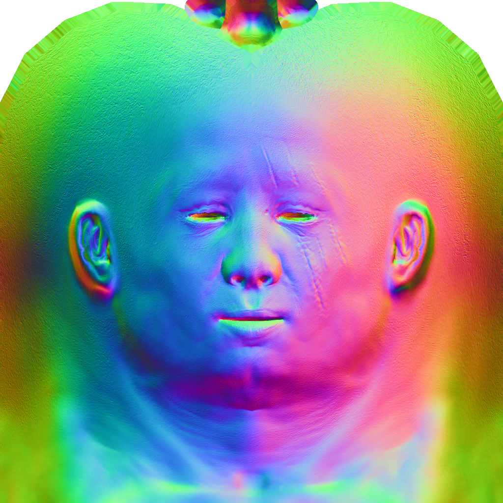
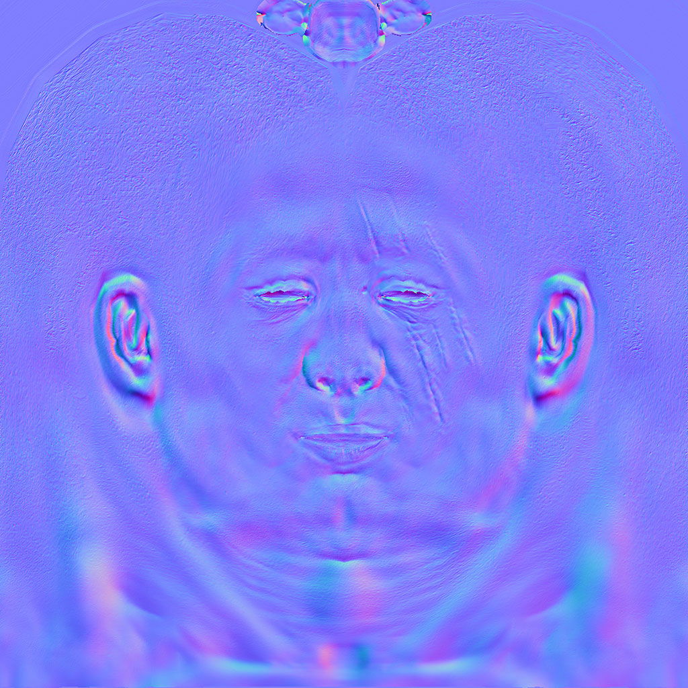

# 如何拆分  

```cpp
int main(int argc, char** argv) {
    if (2==argc) {
        model = new Model(argv[1]);
    } else {
        model = new Model("obj/african_head.obj");
    }

    lookat(eye, center, up);
    viewport(width/8, height/8, width*3/4, height*3/4);
    projection(-1.f/(eye-center).norm());
    light_dir.normalize();

    TGAImage image  (width, height, TGAImage::RGB);
    TGAImage zbuffer(width, height, TGAImage::GRAYSCALE);

    GouraudShader shader;
    for (int i=0; i<model->nfaces(); i++) {
        Vec4f screen_coords[3];
        for (int j=0; j<3; j++) {
            screen_coords[j] = shader.vertex(i, j);
        }
        triangle(screen_coords, shader, image, zbuffer);
    }

    image.  flip_vertically(); // to place the origin in the bottom left corner of the image
    zbuffer.flip_vertically();
    image.  write_tga_file("output.tga");
    zbuffer.write_tga_file("zbuffer.tga");

    delete model;
    return 0;
}
```

上述代码是之前的main函数(有稍加改动,但不影响),

可以看到在main函数中我们做了很多事情  

- 1. 解析obj文件
- 2. 初始化MVP矩阵
- 3. 三角形遍历,并且光栅化

最后一个阶段是最有趣的,外部的循环是用来遍历所有的三角形，内部的循环是对当前三角形的三个顶点进行 顶点着色(使用顶点着色器),

`顶点着色器`的主要任务是:  
- 1. 顶点坐标变换
- 2. 准备片元着色器的数据

`片元着色器`的主要任务是:  
- 1. 决定当前片元(片元!=像素)的颜色
- 2. 决定是否丢弃当前片元

比如OpenGLES2.0的渲染管线(旧版本)


**注意,GL2是没有几何着色器的,在这里先不考虑这个**

# Normalmapping(法线映射)  

实际上,我们可以将模型的法线作为一个法线贴图存在一个贴图中.其中法线的xyz作为贴图的rgb  

其中法线主要有两种表现方式,如下面两个图所示  

> 全局空间(笛卡尔坐标系)下
  

> 切线空间(Darboux坐标系)下


# 结果  


> 有uv坐标的结果

